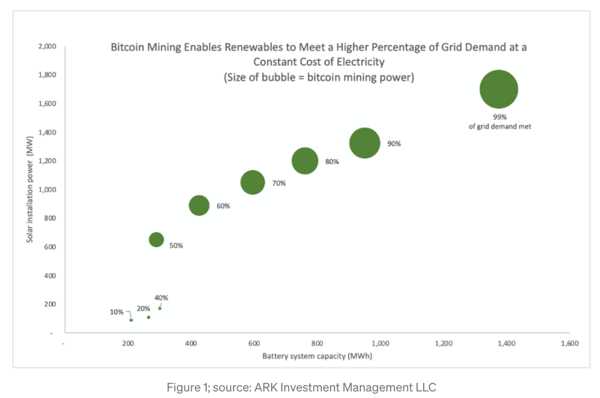
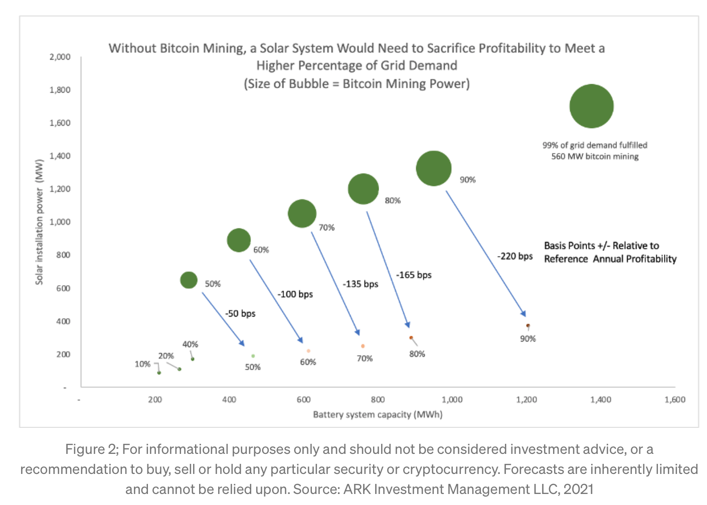
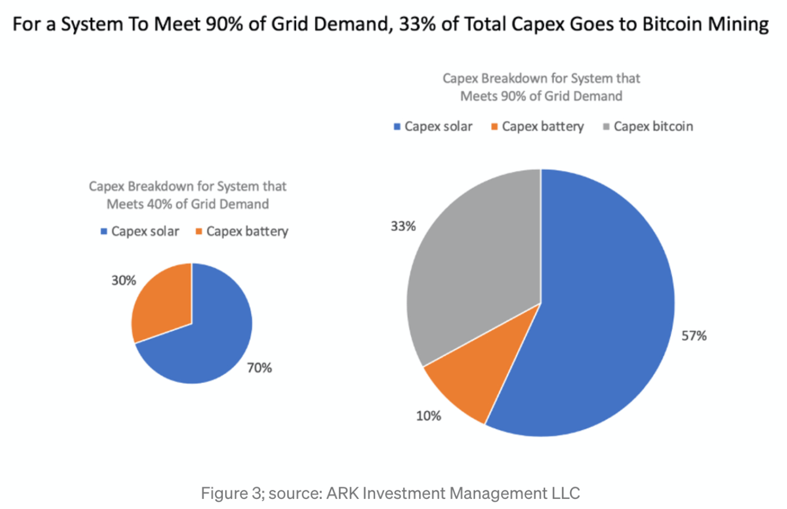
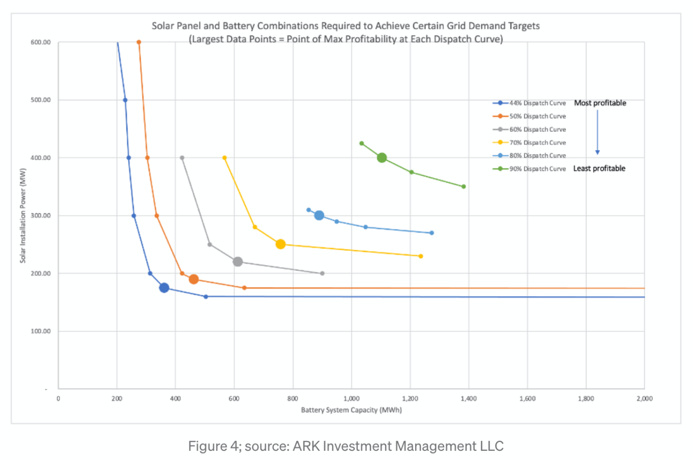

# SolarBatteryBitcoin
This file “Solar_Battery_Bitcoin_Open_Source” includes ARK Invest's proof-of-concept model for a solar, battery, and Bitcoin mining system that provides energy to the grid. 

Before you do anything, please read this [blog](https://medium.com/@wintonARK/fc91c5aa9be0?source=friends_link&sk=82dbcae32c8c6868bce7d24644ed6cee) for a more detailed discussion of our assessment.  
 
The model uses a simulated year of sunlight from NREL’s PVWatts tool and pairs it with historical electricity prices and electricity demand for the same location. In this case, Austin, Texas. It also uses historical bitcoin prices, miner revenue, and network hash rates for the year 2020. Miner hardware specifications are an average blend of the Antminer S9, S17, and S19.

The logic of the model is optimized to prioritize meeting grid demand. That is, the sun's energy will not be used to mine bitcoin unless the demand from the grid is first met. Once grid demand is met, the model assesses whether it is more profitable to store energy in the battery or mine bitcoin based on trailing profitability levels. The decision to charge the battery or mine bitcoin is nuanced and can best be understood by opening the model. Ultimately the state of charge of the battery also plays a role in determining the flow of energy.  
 
ARK believes the best way to push this modeling exercise forward is to incorporate pricing data from varying geographies and to extend it over a longer timeframe.  

Key Charts:

The graph below illustrates the hypothetical impact that bitcoin mining could have on the adoption of solar systems (solar + batteries). Based on a constant cost of electricity, it traces what percentage of power solar could provide to the grid. The y-axis is the power generated by solar, the x-axis is battery capacity. The size of each circle is proportionate to the size of the bitcoin mining operation. At each point, the solar system provides a different percentage of the grid’s needs. As bitcoin mining scales, the solar system increases in size and provides a higher percentage of the grid’s needs. Increasing bitcoin mining capacity allows the energy provider to “overbuild” solar without wasting energy. In the bottom left of the chart, in the absence of Bitcoin mining, renewables can satisfy only 40% of the grid’s needs. In the top right of the chart, including Bitcoin mining, solar, batteries, and Bitcoin mining can satisfy 99% of the grid’s demand.

Below, we extend upon figure 1 to develop two curves. As before, y-axis is the power of the solar installation, the x-axis is the capacity of the battery installation1 and the size of each point is the size of the bitcoin miner. At each point the system provides a different percentage of the grid’s needs. As the system increases in size the points move up and to the right, and the system provides a higher percentage of the grid’s needs. In the upper curve, system profitability is held constant; the larger bitcoin mining installation allows the system to be effectively over-powered without wasting excess energy. In the lower curve, profitability is optimized without using bitcoin miners at a given target dispatch level. At 90% dispatch there is a >200 basis points in annual return-on-capital difference between a system that can offload power to a bitcoin miner and one that simply relies on solar + battery.

In the figure below we show the percentage of the capital expenditure comprised by a 40% dispatch system and by an equivalent profit system which includes bitcoin mining to increase its ability to grid provision up to 90%.

The model can also be used to dimension the trade-off between solar and battery systems exclusive of a bitcoin miner. Each curve below represents different combinations of solar + battery sizes that can be used to achieve a similar level of electricity dispatch. The “elbow” in each curve (the largest datapoint) is the point of maximum profitability for a given level of dispatch, exclusive of an attached bitcoin mining unit.

A description of each worksheet in the file: 
 
“Inputs and Output” worksheet contains the key inputs and the output of the model. The user can change the Key Inputs (specifically Solar System Size, Battery System Size, and Bitcoin Mining Size) to see how it impacts the percent of the time the system meets demand from the grid and the overall profitability relative to the reference profitability level. The reference profitability level results from an optimized system, which achieves a specific demand target while minimizing capital expense. The worksheet also includes assumptions for the capital and operating costs of solar, batteries, and bitcoin mining hardware. Changing capital or operating assumptions will require the user to manually optimize the system to find the new reference profitability level. 
 
“Sample Outputs” worksheet contains the data used that demonstrates adding bitcoin mining to a solar and battery system allows profitability to remain constant as a greater amount of grid demand is met. There are charts to help visualize the data but note the charts are not dynamic. 
 
“Sample Outputs 2” worksheet contains the data used to find the tradeoff between battery size and solar installation size to meet a specific grid demand level. The elbow of each curve in the chart is the point of max profitability. 
 
“Model” worksheet is where the math happens. Rows one and two contain notes describing each column. 
 
“PVWatt simulated Dispatch” worksheet contains the inputs and outputs from NREL’s PVWatts simulation. This includes the amount of sun per hour and output of a specific system.  
 
“hashrate + miner revenue” worksheet contains hourly bitcoin network hashrate and mining revenue for 2020. 
 
“real time electricity price” worksheet contains real time and day ahead pricing for electricity from the grid. 
 
“Battery dispatch curve multiple” worksheet contains the curve that determines whether electricity should go towards charging the battery or towards Bitcoin mining based on the state of charge of the battery. 
 
“hourly electricity demand Texas” worksheet contains the electricity demand from the grid. 
 
“resources” worksheet contains links to sources used for data. 
 
Disclosure: This work is licensed under a Creative Commons Attribution-Non-Commercial 4.0 International License. You may not use the material for commercial purposes without first obtaining written permission. 
 
2021, ARK Investment Management LLC. All content is original and has been researched and produced by ARK Investment Management LLC (“ARK”) unless otherwise stated herein. 
 
This material is for informational purposes only and does not constitute, either explicitly or implicitly, any provision of services or products by ARK. Nothing contained herein constitutes investment, legal, tax or other advice and is not to be relied on in making an investment or other decision. Investors should determine for themselves whether a particular service or product is suitable for their investment needs or should seek such professional advice for their particular situation. 
 
This material is intended only to provide observations and views of the author(s) at the time of writing, both of which are subject to change at any time without prior notice. Certain of the statements contained herein are statements of future expectations and other forward-looking statements that are based on ARK's current views and assumptions and involve known and unknown risks and uncertainties that could cause actual results, performance or events to differ materially from those expressed or implied in such statements. Past performance is no guarantee of future results. Equities may decline in value due to both real and perceived general market, economic, and industry conditions. 
 
ARK's statements are not an endorsement of any company or a recommendation to buy,sell, or hold any security. For a list of all purchases and sales made by ARK for client accounts during the past year that could be considered by the SEC as recommendations, please go to https://ark-invest.com/wp-content/trades/ARK_Trades.pdf. It should not be assumed that recommendations made in the future will be profitable or will equal the performance of the securities in this list. For full disclosures, please go to https://ark-invest.com/terms-of-use. 
While ARK’s current assessment of the subject company may be positive, please note that it may be necessary for ARK to liquidate or reduce position sizes prior to the company attaining any indicated valuation prices due to a variety of conditions including, but not limited to, client specific guidelines, changing market conditions, investor activity, fundamental changes in the company’s business model and competitive landscape, headline risk, and government/regulatory activity. Additionally, ARK does not have investment banking, consulting, or any type of fee-paying relationship with the subject company. 
 
  
